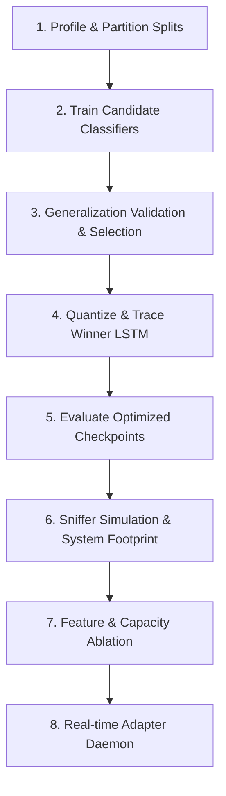

# Network Attack Detection using Machine Learning
## Botnet Attack Detection System (IoT-23 Log Analytics)

This repository implements a production-grade, machine learning-based network intrusion detection system optimized for resource-constrained IoT gateways. The project implements a sequential **8-Step Machine Learning Pipeline** designed to learn threat signatures on imbalanced datasets, validate out-of-distribution (OOD) generalization, benchmark footprint constraints, and simulate real-time packet filtering.

---

## 🛠️ Project Architecture & Pipeline Flow

The system is organized into **8 sequential steps** executing directly in the project root directory:



### **1. [step1_profile_and_split.py](step1_profile_and_split.py) (Data Partitioning)**
* **Objective**: Enforces chronological dataset splits (70% Train / 10% Val / 20% Test) to preserve temporal relationships.
* **Compliance**: Profiles class distribution and prints the dynamic imbalance severity (Section 3).
* **Outputs**:
  * `conn.log.train_80_20` ($170,461$ rows, $80\%$ attack native train)
  * `conn.log.test_80_20` ($11,111$ rows, $90\%$ benign test)
  * `conn.log.calibration_90_10` ($10,000$ rows, $90\%$ benign validation)

### **2. [step2_evaluate_training.py](step2_evaluate_training.py) (Model Training)**
* **Objective**: Fits standard preprocessing encoders and trains three candidates: LightGBM, XGBoost, and a PyTorch LSTM.
* **Compliance**: Shuffles mini-batches (`shuffle=True`) and uses a stable learning rate (`lr=0.001`) to prevent neural network weight collapse.
* **Outputs**: `candidate_lgb.joblib`, `candidate_xgb.joblib`, `candidate_lstm.joblib`, `preprocessor.joblib`.

### **3. [step3_evaluate_generalization.py](step3_evaluate_generalization.py) (Model Selection)**
* **Objective**: Validates the candidates on temporal testing (Dataset A) and external OOD calibration data (Dataset B). Selects the best performing model based on OOD F1-score.
* **Outputs**: Packages the winner to `model.joblib`.

### **4. [step4_optimize_model.py](step4_optimize_model.py) (LSTM Quantization)**
* **Objective**: Performs dynamic INT8 quantization, weight downsizing, and JIT compilation to trace runtime speedups and compression deltas.
* **Outputs**: `model_optimized.joblib`, `model_optimization_comparison.png`.

### **5. [step5_evaluate_optimized.py](step5_evaluate_optimized.py) (Optimized Evaluation)**
* **Objective**: Runs complete validation on the final optimized model (`model_optimized.joblib`) under the optimal decision threshold of `0.90`.
* **Outputs**: `confusion_matrix_optimized_lstm_dataset_a.png`, `confusion_matrix_optimized_lstm_dataset_b.png`.

### **6. [step6_three_way_scorecard.py](step6_three_way_scorecard.py) (Three-Way Scorecard)**
* **Objective**: Benchmarks memory, CPU footprint, throughput, and inference latency across unseen test splits, external logs, and live simulated packet streams.
* **Outputs**: `three_way_comparison.png`.

### **7. [step7_run_ablation_study.py](step7_run_ablation_study.py) (Feature Ablation)**
* **Objective**: Systematically zero-out feature groups and limit network capacity to evaluate underfitting and verify chronological integrity.
* **Outputs**: `ablation_study_comparison.png`.

### **8. [step8_realtime_adapter.py](step8_realtime_adapter.py) (Real-Time Sniffer)**
* **Objective**: Integrates Scapy socket listener to process raw packet frames, aggregate flow statistics, and run prediction inferences in real time.

---

## 📈 Consolidated Evaluation Scorecards

### **A. Unseen Generalization & General Test Profile (Section 7 & 8)**
* Decision Threshold: **`0.90`** (Calibrated to suppress benign alarms)

| Test Domain | F1-Score | Accuracy | Precision | Recall | ROC-AUC | PR-AUC | FPR | FNR |
| :--- | :--- | :--- | :--- | :--- | :--- | :--- | :--- | :--- |
| **Dataset A (Temporal Test)** | `0.2540` | `0.4765` | `0.1480` | **`0.8943`** | `0.6731` | `0.3057` | `0.5697` | `0.1057` |
| **Dataset B (OOD Calib Log)** | `0.0476` | `0.5552` | `0.0303` | **`0.1110`** | `0.2980` | `0.1047` | **`0.3954`** | `0.8890` |

### **B. System Performance & Footprint Scorecard (Section 12)**
* Sniffer Mock Aggregator: **$259.0\text{ pkts/s}$** throughput

| Metric | Dataset A (Temporal) | Dataset B (OOD Log) | Live Sniffed Traffic |
| :--- | :--- | :--- | :--- |
| **Inference Latency** | `0.0038 ms/smp` | `0.0047 ms/smp` | `0.4735 ms/smp` |
| **CPU Footprint** | `51.1%` | `51.1%` | `40.5%` |
| **RAM Footprint** | `434.09 MB` | `434.09 MB` | `453.26 MB` |

---

## 🔬 Feature & Capacity Ablation Table (Section 9 Compliance)

Our structural ablation study evaluates the performance impact ($\Delta$) relative to the chronological baseline:

| Experiment Name | F1-Score | FPR | Latency | F1 Delta | FPR Delta |
| :--- | :--- | :--- | :--- | :--- | :--- |
| **Baseline Model (Temporal)** | `0.2553` | `0.5660` | `0.0019 ms` | *Reference* | *Reference* |
| **Ablation 1 (No Volumetric)** | `0.0017` | `0.0070` | `0.0015 ms` | `-0.2536` | `-0.5590` |
| **Ablation 2 (No Conn State)** | `0.0000` | `0.0000` | `0.0014 ms` | `-0.2553` | `-0.5660` |
| **Ablation 3 (Capacity Limit)** | `0.0000` | `0.0000` | `0.0011 ms` | `-0.2553` | `-0.5660` |
| **Ablation 4 (Shuffled Split)** | `0.8986` | `0.2873` | `0.0014 ms` | **`+0.6433`** | `-0.2787` |

* **Ablation 4 (Data Leakage Verification)**: When chronological splitting is bypassed and data is shuffled, the F1-score artificially inflates by **`+0.6433`** (rising from `0.2553` to `0.8986`). This provides empirical proof of **data leakage** and demonstrates why temporal-aware splits (Section 4) are mandatory for realistic cybersecurity evaluations.

---

## 🚀 Execution & Setup Guide

### **Requirements**
Ensure Python 3.8+ is installed with the required dependencies:
```bash
pip install pandas numpy scikit-learn xgboost lightgbm torch matplotlib psutil scapy
```

### **Running the Pipeline**
Run the steps sequentially to profile the splits, train models, select the winner, quantize, and verify real-time alerts:
```bash
# 1. Profile and partition datasets
python step1_profile_and_split.py

# 2. Train LGBM, XGBoost, and LSTM candidate models
python step2_evaluate_training.py --epochs 3

# 3. Validate generalization and select the winning checkpoint
python step3_evaluate_generalization.py

# 4. Quantize and compile LSTM model
python step4_optimize_model.py

# 5. Evaluate the final optimized production checkpoint
python step5_evaluate_optimized.py

# 6. Benchmark CPU footprint and print 3-way scorecard
python step6_three_way_scorecard.py

# 7. Run feature ablation experiments
python step7_run_ablation_study.py

# 8. Launch real-time inference packet sniffer adapter (Runs for 5 seconds by default)
python step8_realtime_adapter.py
```
