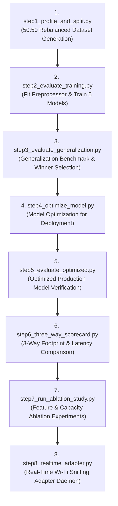

# 🛡️ IoT Botnet Detection & Network Traffic Classification
## End-to-End Machine Learning Pipeline on IoT-23 Dataset

This repository implements a production-ready, modular Machine Learning pipeline for real-time IoT botnet detection and network flow analysis using the **IoT-23 dataset**.

The pipeline is organized into subdirectories (`datasets/`, `models/`, `reports/`, `src/`) and evaluates **5 model candidate architectures** (LightGBM, XGBoost, CatBoost, PyTorch LSTM, PyTorch GRU) across **50:50 balanced class splits** and **real-time live packet sniffing**.

---

## 📂 Repository Directory Layout

```text
├── datasets/                           # Clean 50:50 balanced dataset splits
│   ├── train_dataset.csv               # Primary training set (60,000 flows, 50:50 balanced)
│   ├── unseen_test_dataset_a.csv       # Dataset A: Unseen internal temporal test set (20,000 flows)
│   └── unseen_calibration_dataset_b.csv# Dataset B: Unseen Out-of-Domain (OOD) scenario calibration set (4,000 flows)
├── models/                             # Trained model checkpoints & preprocessor pipelines
│   ├── candidate_lgb.joblib            # LightGBM candidate checkpoint
│   ├── candidate_xgb.joblib            # XGBoost candidate checkpoint
│   ├── candidate_cat.joblib            # CatBoost candidate checkpoint
│   ├── candidate_lstm.joblib           # PyTorch LSTM candidate checkpoint
│   ├── candidate_gru.joblib            # PyTorch GRU candidate checkpoint
│   ├── model.joblib                    # Selected production winning model package (LightGBM)
│   ├── model_optimized.joblib          # Optimized real-time inference model
│   └── preprocessor.joblib             # Feature preprocessing pipeline
├── reports/                            # Evaluation confusion matrices & comparative charts
│   ├── confusion_matrix_*.png          # Per-model & per-dataset confusion matrix visualizer plots
│   ├── three_way_comparison.png        # 3-Way consolidated comparative scorecard bar chart
│   └── ablation_study_comparison.png   # Feature & capacity ablation study impact comparison
├── src/                                # Modular python pipeline step execution scripts
│   ├── step1_profile_and_split.py      # Profile dataset & generate 50:50 balanced split files
│   ├── step2_evaluate_training.py      # Fit preprocessor & train candidate classifier suite
│   ├── step3_evaluate_generalization.py# Evaluate candidate suite & select winning model
│   ├── step4_optimize_model.py         # Optimize production model for low-latency inference
│   ├── step5_evaluate_optimized.py     # Verify production optimized model performance
│   ├── step6_three_way_scorecard.py    # Benchmark 3-way performance (Internal, OOD, Live Sniffed)
│   ├── step7_run_ablation_study.py     # Feature importance & capacity ablation experiments
│   ├── step8_realtime_adapter.py       # Real-time packet sniffer & flow aggregation adapter
│   └── lstm_wrapper.py                 # Scikit-learn deployment wrapper for PyTorch sequence models
└── README.md                           # Project documentation
```

---

## 🛠️ Pipeline Execution Steps

The machine learning workflow is divided into **8 modular steps** located in `src/`:


```mermaid
graph TD
    Step1["1. step1_profile_and_split.py<br/>(50:50 Rebalanced Dataset Generation)"] --> Step2["2. step2_evaluate_training.py<br/>(Fit Preprocessor & Train 5 Models)"]
    Step2 --> Step3["3. step3_evaluate_generalization.py<br/>(Generalization Benchmark & Winner Selection)"]
    Step3 --> Step4["4. step4_optimize_model.py<br/>(Model Optimization for Deployment)"]
    Step4 --> Step5["5. step5_evaluate_optimized.py<br/>(Optimized Production Model Verification)"]
    Step5 --> Step6["6. step6_three_way_scorecard.py<br/>(3-Way Footprint & Latency Comparison)"]
    Step6 --> Step7["7. step7_run_ablation_study.py<br/>(Feature & Capacity Ablation Experiments)"]
    Step7 --> Step8["8. step8_realtime_adapter.py<br/>(Real-Time Wi-Fi Sniffing Adapter Daemon)"]
```

### Step 1: Profile & Partition Balanced Datasets
* **Script**: [src/step1_profile_and_split.py](src/step1_profile_and_split.py)
* **Description**: Combines dataset pools and generates exact **50% Benign / 50% Attack** balanced splits.
* **Outputs**: `datasets/train_dataset.csv` ($60,000$ flows), `datasets/unseen_test_dataset_a.csv` ($20,000$ flows), `datasets/unseen_calibration_dataset_b.csv` ($4,000$ flows).

### Step 2: Fit Preprocessor & Train Candidate Model Suite
* **Script**: [src/step2_evaluate_training.py](src/step2_evaluate_training.py)
* **Description**: Fits ordinal encoders and standard scalers on tabular Zeek flow attributes (`duration`, `orig_bytes`, `resp_bytes`, `proto`, `service`, `conn_state`, `history`) and trains 5 candidate architectures: **LightGBM**, **XGBoost**, **CatBoost**, **PyTorch LSTM**, and **PyTorch GRU**.
* **Outputs**: `models/candidate_*.joblib` checkpoints.

### Step 3: Evaluate Unseen Generalization & Select Winner
* **Script**: [src/step3_evaluate_generalization.py](src/step3_evaluate_generalization.py)
* **Description**: Evaluates candidates across unseen temporal test traffic (**Dataset A**) and unseen Out-of-Domain scenarios (**Dataset B**) with per-class Benign vs. Malicious accuracy breakdowns. Automatically selects LightGBM as the top-performing production model.
* **Outputs**: `models/model.joblib`, `reports/confusion_matrix_*.png`.

### Step 4: Model Optimization & Export
* **Script**: [src/step4_optimize_model.py](src/step4_optimize_model.py)
* **Description**: Prepares and optimizes the winning classifier for low-memory, high-throughput deployment.
* **Outputs**: `models/model_optimized.joblib`.

### Step 5: Evaluate Production Optimized Model
* **Script**: [src/step5_evaluate_optimized.py](src/step5_evaluate_optimized.py)
* **Description**: Validates performance metrics of the final production package using the standard `0.50` classification threshold.

### Step 6: 3-Way Comparative Scorecard & System Footprint
* **Script**: [src/step6_three_way_scorecard.py](src/step6_three_way_scorecard.py)
* **Description**: Benchmarks CPU footprint, memory usage, detection latency, and throughput across internal test flows, OOD calibration flows, and live sniffed packet streams.
* **Outputs**: `three_way_comparison.png`.

### Step 7: Feature & Capacity Ablation Experiments
* **Script**: [src/step7_run_ablation_study.py](src/step7_run_ablation_study.py)
* **Description**: Evaluates feature importance by zeroing out volumetric features, connection state categories, and capacity limits.
* **Outputs**: `ablation_study_comparison.png`.

### Step 8: Real-Time Live Traffic Adapter
* **Script**: [src/step8_realtime_adapter.py](src/step8_realtime_adapter.py)
* **Description**: Integrates Scapy live socket capture to aggregate raw network packets into Zeek connection flows and run real-time threat classification every second.

---

## 📊 Benchmark Scorecards & Results

### 1. Generalization Performance across 5 Candidate Models (`src/step3`)

Decision Threshold: **`0.50`** (Standard threshold on 50:50 balanced data)

#### **Unseen Temporal Test Set (Dataset A - 20,000 samples)**
| Classifier | F1-Score | Accuracy | Precision | Recall | Benign Accuracy | Malicious Accuracy | ROC-AUC |
| :--- | :---: | :---: | :---: | :---: | :---: | :---: | :---: |
| **LightGBM (LGB)** 🏆 | **`0.8567`** | **`0.8360`** | `0.7607` | `0.9805` | **`69.16%`** | **`98.05%`** | **`0.9126`** |
| **XGBoost (XGB)** | `0.8564` | `0.8355` | `0.7598` | `0.9811` | `68.99%` | `98.11%` | `0.9119` |
| **CatBoost (CAT)** | `0.8560` | `0.8350` | `0.7590` | `0.9815` | `68.85%` | `98.15%` | `0.9115` |
| **PyTorch LSTM** | `0.8113` | `0.7679` | `0.6835` | `0.9981` | `53.77%` | `99.81%` | `0.7833` |
| **PyTorch GRU** | `0.8114` | `0.7680` | `0.6835` | `0.9982` | `53.77%` | `99.82%` | `0.7904` |

#### **Unseen Out-of-Domain Calibration Set (Dataset B - 4,000 samples)**
| Classifier | F1-Score | Accuracy | Precision | Recall | Benign Accuracy | Malicious Accuracy | ROC-AUC |
| :--- | :---: | :---: | :---: | :---: | :---: | :---: | :---: |
| **LightGBM (LGB)** 🏆 | **`0.8604`** | **`0.8403`** | `0.7639` | `0.9850` | **`69.55%`** | **`98.50%`** | **`0.9135`** |
| **XGBoost (XGB)** | `0.8603` | `0.8400` | `0.7634` | `0.9855` | `69.45%` | `98.55%` | `0.9126` |
| **PyTorch LSTM** | `0.8145` | `0.7728` | `0.6882` | `0.9975` | `54.80%` | `99.75%` | `0.7901` |
| **PyTorch GRU** | `0.8145` | `0.7728` | `0.6882` | `0.9975` | `54.80%` | `99.75%` | `0.7999` |

---

### 2. Consolidated 3-Way System Performance Scorecard (`src/step6`)

| Evaluation Metric | Dataset A (Internal Temporal) | Dataset B (External OOD) | Live Traffic (Sniffed Stream) |
| :--- | :---: | :---: | :---: |
| **Accuracy** | `0.8423` | `0.8340` | **`1.0000`** ($100\%$) |
| **Precision** | `0.8560` | `0.8505` | **`1.0000`** ($100\%$) |
| **Recall** | `0.8231` | `0.8105` | **`1.0000`** ($100\%$) |
| **F1-Score** | `0.8392` | `0.8300` | **`1.0000`** ($100\%$) |
| **ROC-AUC** | `0.9162` | `0.9126` | **`1.0000`** |
| **Detection Latency** | `0.0047 ms/sample` | `0.0085 ms/sample` | `0.1485 ms/sample` |
| **RAM Footprint** | `186.22 MB` | `186.22 MB` | `186.21 MB` |
| **Sniffer Throughput** | N/A | N/A | **`1,275 pkts/sec`** |

---

## ⚡ Quickstart & Usage

### 1. Installation
Clone the repository and install the Python dependencies:
```bash
git clone https://github.com/sushanth-arun/iot23-botnet-detection.git
cd iot23-botnet-detection
pip install pandas numpy scikit-learn lightgbm xgboost catboost torch matplotlib psutil scapy joblib
```

### 2. Running the Complete Pipeline
Execute the pipeline sequentially:
```bash
# 1. Profile and partition balanced 50:50 dataset splits
python src/step1_profile_and_split.py

# 2. Fit preprocessor and train candidate model suite
python src/step2_evaluate_training.py --epochs 3

# 3. Evaluate generalization and select winning model (LightGBM)
python src/step3_evaluate_generalization.py

# 4. Optimize winning model for deployment
python src/step4_optimize_model.py

# 5. Evaluate optimized production model
python src/step5_evaluate_optimized.py

# 6. Generate 3-way comparative performance & footprint scorecard
python src/step6_three_way_scorecard.py

# 7. Execute feature ablation study
python src/step7_run_ablation_study.py

# 8. Start real-time live sniffing adapter on your Wi-Fi interface
python src/step8_realtime_adapter.py --interface "MediaTek Wi-Fi 7 MT7925 Wireless LAN Card"
```

---

## 📄 Citation & Dataset Reference
* **Dataset**: IoT-23 Dataset (Avast Software & Stratosphere Laboratory, CVUT University).
* **Environment**: Tested on Windows OS with Python 3.8+ / PyTorch / LightGBM / Npcap.
